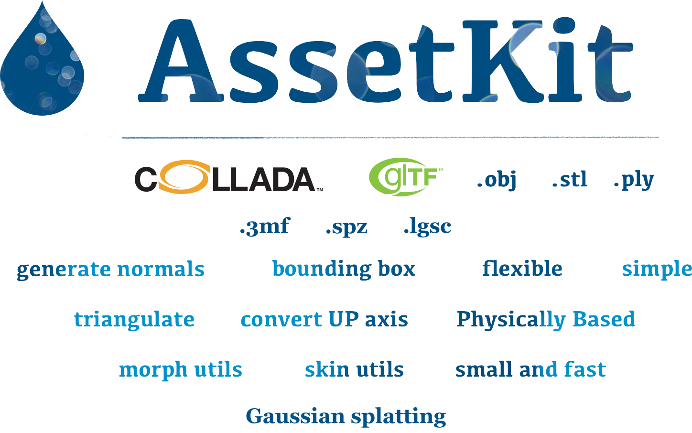

<p align="center">
   
</p>
<br>

<p align="center">
    <a href="https://github.com/recp/AssetKit/actions/workflows/cmake.yml">
        
    </a>
    <a href="https://coveralls.io/github/recp/assetkit?branch=master">
        
    </a>
    
    <br /><br />
    <a href="https://patreon.com/recp">
      
    </a>
    <a href="#sponsors">
        
    </a>
    <a href="#backers">
        
    </a>
</p>

<br>

<p align="center">
Brand-new modern 3D asset importer, exporter library. This library will include common 3D utils funcs. It is written with C99 but C++ wrappers or other language bindings can be written in the future.

This library will try to full support COLLADA specs and glTF specs, plus well-known other 3D formats e.g .obj, .stl, .ply... 

</p>

#### 📚 Documentation (In Progress)

Almost all functions (inline versions) and parameters will be documented inside the corresponding headers. <br />
Complete documentation: http://assetkit.readthedocs.io

Runtime metadata and extension notes:

- [Extras and extension data](EXTRAS.md)
- [glTF extensions and optional decoders](EXTENSIONS.md)

## 💪 Supported Formats

* [ ] Asset Exchange (todo) http://github.com/AssetExchange/spec
* [x] COLLADA 1.4 and COLLADA 1.4.1
* [x] COLLADA 1.5
* [x] glTF 2.0 (Embedded or Separated (.gltf), Binary (.glb), Extensions...)
* [x] Wavefront Obj (.obj + .mtl)
* [x] STL (ASCII, Binary)
* [x] PLY (ASCII, Binary)
* [x] 3MF
* [ ] FBX (License?, probably need to download FBX SDK externally)
* [ ] USD and friends (License?)
* [ ] Alembic (License?)
* [x] Draco
* [ ] X3D
* [x] in progress for next...
* [x] Exporter

## 🚀 Features

- Single interface for glTF 2.0 (with extensions), COLLADA 1.4/1.4.1/1.5, Wavefront Obj and others...
- Very very small and very fast library
- Javascript-like API to get URL or ID `obj = ak_getObjectById(doc, objectId)`...
- Options to Generate Mesh Normals *(Default: enabled)*
- Option to Triangulate Polygons *(Default: enabled)*
- Option to change Coordinate System *(Default: enabled)*
- Option to calculate Bounding Boxes *(Default: enabled)*
- Unique and Flexible Coordinate System
  - Support multiple coordinate system
  - Can convert any coordinate system to another with adding transform or with changing transform, vertex data...
- Unique and Flexible Memory Management System
  - Hierarchical unique memory management
    - When a node is freed then all sub memories will be freed
  - COLLADA's **sid** and **ID** values are mapped to memory nodes itself to reduce memory size and make it easy to manage things.
  - Allow attach ID, sid or user data to a memory node
- Object-based Asset support; resolve asset element for any element
- Bugfix some DAE files
- Will be optimized to be fastest, smallest and most flexible, extendible Asset loader.
- Uses **mmap** to load files, you can disable this if needed
- [ ] Documentation
- [x] Cmake support
- [ ] Tests

## 🔨 Build

AssetKit uses CMake on macOS, Linux and Windows. It can be built as a
standalone project, embedded with `add_subdirectory()` or installed and used
with `find_package()`.

### Standalone CMake build

```bash
$ cmake -S . -B build -DCMAKE_BUILD_TYPE=Release
$ cmake --build build
$ cmake --install build # [Optional]
```

On multi-config generators such as Visual Studio or Xcode:

```bash
$ cmake -S . -B build
$ cmake --build build --config Release
$ cmake --install build --config Release # [Optional]
```

Release builds use the platform compiler's optimized release mode. AssetKit
also has `AK_ENABLE_LTO=ON` for link-time optimization when the compiler and
generator support it; it is off by default for predictable cross-platform
builds.

##### CMake options with defaults:

```CMake
option(AK_SHARED "Shared build" ON)
option(AK_STATIC "Static build" OFF)
option(AK_USE_TEST "Enable Tests" OFF)
option(AK_BUILD_EXPORTERS "Build asset export support" ON)
option(AK_BUILD_DAE_EXPORTER "Build COLLADA/DAE exporter" ON)
option(AK_BUILD_GLTF_EXPORTER "Build glTF/GLB exporter" ON)
option(AK_BUILD_OBJ_EXPORTER "Build Wavefront OBJ exporter" ON)
option(AK_BUILD_STL_EXPORTER "Build STL exporter" ON)
option(AK_BUILD_PLY_EXPORTER "Build PLY exporter" ON)
option(AK_BUILD_3MF_EXPORTER "Build 3MF exporter" ON)
option(AK_BUILD_DECODER_SHIMS "Build optional decoder shim libraries" ON)
option(AK_BUILD_GLTF_DRACO_DECODER "Build optional glTF Draco decoder shim" ON)
option(AK_BUILD_GLTF_MESHOPT_DECODER "Build optional glTF meshoptimizer decoder shim" ON)
option(AK_BUILD_GLTF_SPZ_DECODER "Build optional glTF Gaussian splatting (SPZ) decoder shim" ON)
option(AK_BUILD_GLTF_KTX2_DECODER "Build optional glTF KHR_texture_basisu (KTX2/BasisU) decoder shim" ON)
option(AK_FETCH_DEPS "Fetch optional decoder dependencies into AK_DEPS_ROOT when missing" ON)
option(AK_BUILD_SAMPLES "Build AssetKit sample programs" OFF)
option(AK_ENABLE_LTO "Enable link-time optimization for release builds" OFF)
```

Use `-DAK_BUILD_EXPORTERS=OFF` for import-only builds, such as game engines
that load assets but do not write DAE/glTF/OBJ/STL/PLY/3MF files. The public
`ak_export()` symbol remains available and returns an error, but exporter
implementation files are not compiled into `libassetkit`. Keep
`AK_BUILD_EXPORTERS=ON` and disable individual `AK_BUILD_*_EXPORTER` options
for format-specific export builds.

Optional glTF compression decoders are side libraries. They are built next to
the main C library by default, but not linked into `libassetkit`. CMake fetches
missing decoder dependencies into `deps/` by default, so a normal standalone
build produces `libassetkit`, `libassetkit_draco` and
`libassetkit_meshoptimizer` when network access is available:

```bash
$ cmake -S . -B build
$ cmake --build build
```

Use `-DAK_FETCH_DEPS=OFF` with `AK_DRACO_ROOT` / `AK_MESHOPT_ROOT` for
offline or packaged builds. Use `-DAK_BUILD_GLTF_DRACO_DECODER=OFF` or
`-DAK_BUILD_GLTF_MESHOPT_DECODER=OFF` to skip individual side libraries, or
`-DAK_BUILD_DECODER_SHIMS=OFF` to skip all optional decoder shim targets.

### Samples

Small copyable C samples live in `samples/` and can be enabled in the main
build:

```bash
$ cmake -S . -B build -DAK_BUILD_SAMPLES=ON
$ cmake --build build --target assetkit_sample_read_meshes
```

They can also be built as a standalone CMake project against an installed
AssetKit package:

```bash
$ cmake -S samples -B samples-build -DCMAKE_PREFIX_PATH=/path/to/assetkit/install
$ cmake --build samples-build
```

See [samples/README.md](samples/README.md) for mesh, material, scene, camera,
light and animation examples.

### Embedded in another CMake project

AssetKit can be used like a submodule:

```cmake
cmake_minimum_required(VERSION 3.16)

project(my_app LANGUAGES C)

add_subdirectory(external/assetkit)

add_executable(my_app src/main.c)
target_link_libraries(my_app PRIVATE assetkit::assetkit)
```

When embedded, AssetKit does not force a default build type on the parent
project. If you do not want CMake to fetch optional decoder dependencies while
configuring your parent project, pass:

```cmake
set(AK_FETCH_DEPS OFF CACHE BOOL "" FORCE)
set(AK_BUILD_DECODER_SHIMS OFF CACHE BOOL "" FORCE)
set(AK_BUILD_EXPORTERS OFF CACHE BOOL "" FORCE)
add_subdirectory(external/assetkit)
```

### Installed package

After `cmake --install`, consumers can use:

```cmake
find_package(assetkit CONFIG REQUIRED)
target_link_libraries(my_app PRIVATE assetkit::assetkit)
```

### Windows
Windows builds are supported through CMake. `git` must be available when
`GIT_SUBMODULE=ON` or `AK_FETCH_DEPS=ON`.

```Powershell
$ cmake -S . -B build
$ cmake --build build --config Release
```

## Contributors

This project exists thanks to all the people who contribute. [[Contribute](CONTRIBUTING.md)].
<a href="https://github.com/recp/assetkit/graphs/contributors"></a>


## Backers

Thank you to all our backers! 🙏 [[Become a backer](https://opencollective.com/assetkit#backer)]

<a href="https://opencollective.com/assetkit#backers" target="_blank"></a>


## Sponsors

Support this project by becoming a sponsor. Your logo will show up here with a link to your website. [[Become a sponsor](https://opencollective.com/assetkit#sponsor)]

<a href="https://opencollective.com/assetkit/sponsor/0/website" target="_blank"></a>
<a href="https://opencollective.com/assetkit/sponsor/1/website" target="_blank"></a>
<a href="https://opencollective.com/assetkit/sponsor/2/website" target="_blank"></a>
<a href="https://opencollective.com/assetkit/sponsor/3/website" target="_blank"></a>
<a href="https://opencollective.com/assetkit/sponsor/4/website" target="_blank"></a>
<a href="https://opencollective.com/assetkit/sponsor/5/website" target="_blank"></a>
<a href="https://opencollective.com/assetkit/sponsor/6/website" target="_blank"></a>
<a href="https://opencollective.com/assetkit/sponsor/7/website" target="_blank"></a>
<a href="https://opencollective.com/assetkit/sponsor/8/website" target="_blank"></a>
<a href="https://opencollective.com/assetkit/sponsor/9/website" target="_blank"></a>


### Trademarks

glTF and COLLADA and their logos are trademarks of Khronos Group.
