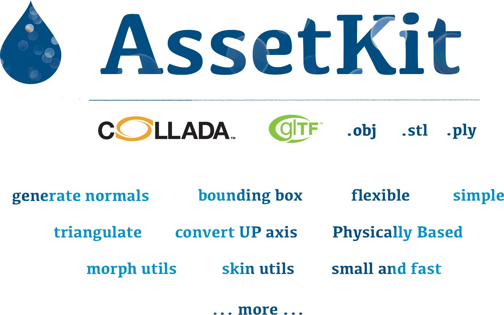

.. cglm documentation master file, created by
   sphinx-quickstart on Tue Jun  6 20:31:05 2017.
   You can adapt this file completely to your liking, but it should at least
   contain the root `toctree` directive.

|

**AssetKit** is brand-new 2D/3D asset importer, exporter and util library that
is written in C language. C++ wrappers or other language bindings 
can be written in the future. This library will include common 3D util funcs.

Supported Formats
================================================================================

* [x] COLLADA 1.4 and COLLADA 1.4.1
* [x] COLLADA 1.5
* [x] glTF 2.0 (Embedded or Separated (.gltf), Binary (.glb), Extensions...)
* [x] Wavefront Obj (.obj + .mtl)
* [x] STL (ASCII, Binary)
* [x] PLY (ASCII, Binary)
* [ ] USD and friends (License?)
* [ ] Alembic (License?)
* [ ] Draco
* [ ] X3D
* [x] in progress for next...

Features
================================================================================

* Very very small, very fast and flexible library
* Single interface for glTF 2.0 (with extensions), COLLADA 1.4/1.4.1/1.5, Wavefront Obj and others...
* Javascript-like API to get URL or ID `obj = ak_getObjectById(doc, objectId)`...
* Options to Generate Mesh Normals *(Default: enabled)*
* Option to Triangulate Polygons *(Default: enabled)*
* Option to change Coordinate System *(Default: enabled)*
* Option to calculate Bounding Boxes *(Default: enabled)*
* Unique and Flexible Coordinate System
  * Support multiple coordinate system
  * Can convert any coordinate system to another with adding transform or with changing transform, vertex data...
* Unique and Flexible Memory Management System 
    * Hierarchical unique memory management 
    * When a node is freed then all sub memories will be freed
    * COLLADA's **sid** and **ID** values are mapped to memory nodes itself to reduce memory size and make it easy to manage things.
    * Allow attach ID, sid or user data to a memory node
* Object-based Asset support; resolve asset element for any element
* Bugfix some DAE files
* Will be optimized to be fastest, smallest and most flexible, extendible Asset loader.
* and others...

.. toctree::
   :maxdepth: 2
   :caption: Getting Started:

   build
   getting_started

.. toctree::
   :maxdepth: 2
   :caption: API:

   api

.. toctree::
   :maxdepth: 2
   :caption: Options:

   opt

Indices and tables
==================

* :ref:`genindex`
* :ref:`modindex`
* :ref:`search`
